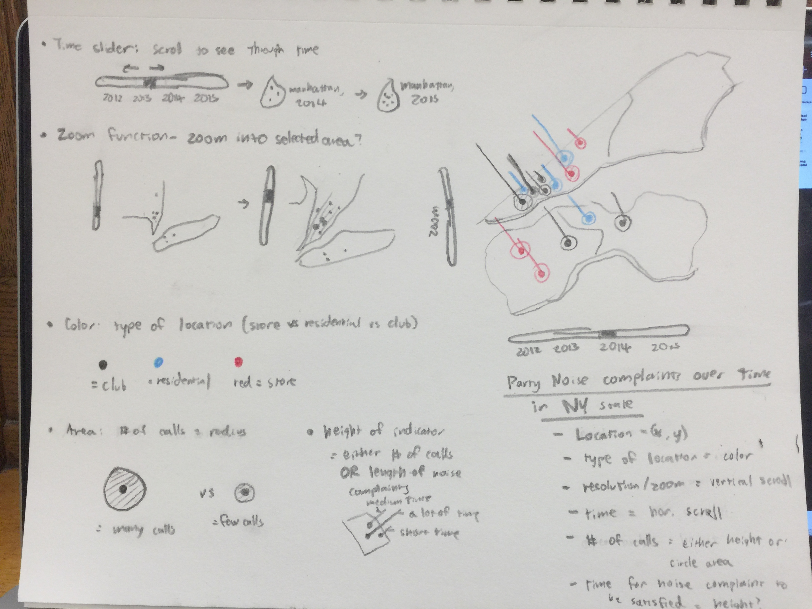
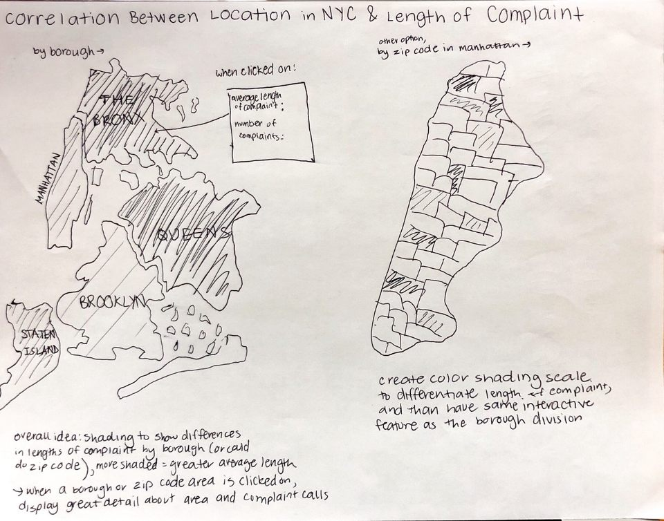

# CS-3300-Project-2
**Status Updates are accumulated as time moves on.**

---
## Status Update #1: Team Contract & Project Ideas

_Due March 23, 2018_

### Project Ideas:

1. Predict the onset of Parkinson’s from typing tendencies ([Link](https://www.kaggle.com/valkling/tappy-keystroke-data-with-parkinsons-patients))  
Create keyboard visualization  

2. Food choices and preferences of college students ([Link](https://www.kaggle.com/borapajo/food-choices))  
Create visualization of food pyramid, where user can click on each section and see details about how students prefer/cook/eat the different groups

3. Noise complaints to NYC police about loud parties ([Link](https://www.kaggle.com/somesnm/partynyc))  
Data includes time of the call, time of the police response, coordinates and part of the city  
Create visualization of NYC map where you can click on a borough/area of city and see more information about the complaints

4. Education status around the world ([Link](https://www.kaggle.com/theworldbank/education-statistics))  
Create world map visualization where you can click on a region and see information about education access, progression, completion, literacy, teachers, population, and expenditures  
Use shading to see differences in worldwide education levels and access abilities

5. Baby names in New York City ([Link](https://www.kaggle.com/new-york-city/nyc-baby-names))  
See how baby names in NYC differ from national trends  
Look at what names are more or less popular among different ethnicities  
Also incorporate different data set that looks at ethnicities in NYC

6. Halloween Candy Ranking ([Link](https://www.kaggle.com/fivethirtyeight/the-ultimate-halloween-candy-power-ranking))  
Create visualization of open bag of Halloween candy  
Size of candy correlates to ranking

7. Movie Rankings based on IMDb ([Link](https://www.kaggle.com/tmdb/tmdb-movie-metadata/data))  
Database collection of data on most recent movies, such as revenue, cast, budget, genres, etc.  
Visualization can perhaps feature relationship between the success of movies and certain aspects about them - like a visualization that groups movies together and compares how they stack up with one another and with other groups

8. YouTube Trending Statistics ([Link](https://www.kaggle.com/datasnaek/youtube-new))  
Dataset contains various data on trending or trend-ed videos on the YouTube video-sharing platform  
Visualization can explore certain connections between trending and other characteristics - also additional data from dataset can extrapolate other correlations  such as sentiment analysis or statistics over time

9. Kickstarter Projects ([Link](https://www.kaggle.com/kemical/kickstarter-projects/data))  
Dataset contains all information in both 2016 and 2018 and consists of additional details about each kickstarter, for example about their status (failed, canceled, or succeeded), number of pledgers, budget.  
Visualization doesn’t need to be about correlations between success and a factor - we can just showcase the range of different kickstarters out there and try to group them based on certain factors.

10. Spotify Top Songs 2017 ([Link](https://www.kaggle.com/nadintamer/top-tracks-of-2017))  
Dataset contains the most popular Spotify songs of 2017, their artists, and audio features (tempo, ket, etc.)  
Could visualize trends on what these popular songs have in common  
Interaction by choosing different criteria to see how many popular songs have that in common

### Tasks for each member:

* Cari - begin thinking about design aspects (focus on some ideas)  
* Ryan - set up GitHub   
* Joaquin - look into a few of the above ideas and find concrete data sets and look into the data and see how it is organized and how it could be worked with  

---
## Status Update #2: Narrowing of Ideas, Sketching

_Due March 30, 2018_

### Sketches & Initial Ideas for Datasets

The datasets we've decided to focus on are either #2 (Food choices and prefernces of college students) or #3 (Noise complaints to NYC police about loud parties). As of this moment, we're still unsure about which dataset to pursue fully, so our sketches will be divided between the two. Discussions about which dataset to choose will occur by the next status update.

#### Sketch #1: Party & Noise Complaints in NY State over Time

#### Sketch #2: Party & Noise Complaints in NY State over Time

#### Sketch #3: 

#### Sketch #4:

### Tasks for each member:

* Everybody:
	* Meet to discuss which dataset to use
	* Decide on what to present and how to present it.
* Joaquin: 
	* Create mockups of possible visualizations for our final design based on our discussion
* Ryan: 
	* Download and alter database to ensure it is usable for the purposes we discussed
* Cari: 
	* Iterate on Ryan’s work to practice displaying data from the dataset onto a webpage.

---

## Project 2 Status 3 - Progress and Tasks
Cari Himel (cjh326), Joaquin Amante (aya24), Ryan Kim (rk494)

### Summary of Progress:
We've finalized the data we'll be using for our project. We will be working with the NYC party data and attempts to cross-reference parties that have occurred in NYC with noise complaints for that year. By doing so, we hope to emphasize the number of incidents that occur in NYC due to parties alone. 

Here's a link to it, for reference: [https://www.kaggle.com/somesnm/partynyc](https://www.kaggle.com/somesnm/partynyc)
 
In addition, we also needed map data in order to properly map NYC’s five boroughs. Luckily we found map data located here: [https://gist.github.com/phil-pedruco/6646844](https://gist.github.com/phil-pedruco/6646844)

In order to run what we've done so far, we needed 2 JavaScript Libraries: d3 and jQuery. Both have been downloaded and saved locally, so there will be no problems in case the internet runs out.

### Tasks Accomplished by Each Member:
* Cari: Responsible for the front-end design of our visualization - worked to make the implementation created by Ryan (back-end) look presentable
* Ryan: Responsible for the back-end coding of our visualization - worked to collect relevant data from datasets and translate the data into basic visuals.
* Joaquin: Due to unforeseen circumstances, Joaquin is unable to work for the time being. Ryan and Cari have agreed to take on Joaquin's portion of the work until Joaquin is able to work once more.

### Upcoming tasks:
* Cari: Brainstorm and plan out ways to make data visualization more salient - will implement changes to visualization after Ryan has accomplished what needs to be done on the back-end in response to Cari’s brainstorming
* Ryan: After Cari’s brainstorming, Ryan will implement the changes on the back-end side of the visualization to make the visualization possible.
* Joaquin: Due to unforeseen circumstances, Joaquin is unable to work for the time being. Ryan and Cari have agreed to take on Joaquin's portion of the work until Joaquin is able to work once more.

